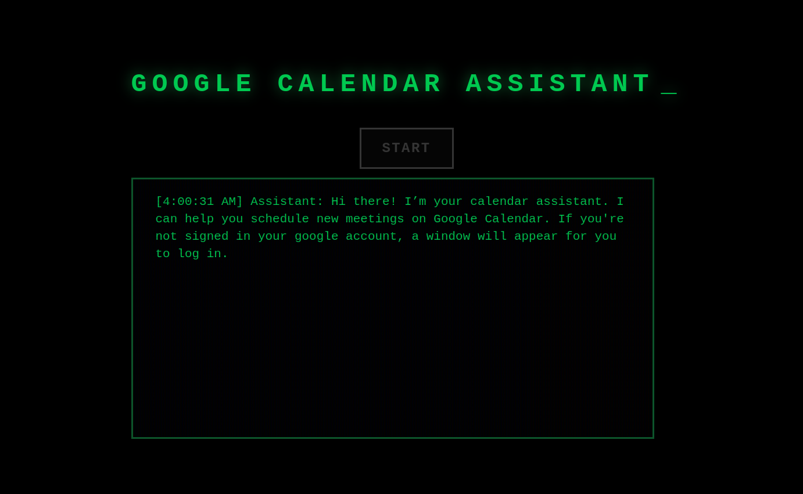

# Voice Calendar Assistant
An intelligent voice assistant designed to help you seamlessly schedule and manage your **Google Calendar** events using natural language.

!

## Prerequisites

### 1. System dependencies
Before setting up the Python environment, ensure you have the necessary system-level dependencies installed:

```bash
# Install audio processing tools
sudo apt-get install ffmpeg libavcodec-extra

# Install Ollama (Local LLM runner)
curl -fsSL [https://ollama.com/install.sh](https://ollama.com/install.sh) | sh

# Pull model 
ollama pull gemma3:12b
```

### 2. Python environment


```bash
# Create and activate the environment
conda create -n audioAssistant python=3.13
conda activate audioAssistant

# Install Python dependencies
pip install -r requirements.txt

# Setup browser automation dependencies
playwright install-deps

```

### 3. Frontend Dependencies
npm install

## Running the Application
To get the assistant up and running, you will need to start both the backend and the frontend services.

### Backend (FastAPI)
The backend handles the voice processing and Google Calendar integration.

```bash
cd backend
fastapi dev ./main.py --port 8000
```

### Frontend (React)

```bash
cd frontend
npm run dev
```